# 1 

The Tereagrunt hcl code for the Qno1 is in the directory `./materials/Terragrunt_Q1/`

DEMO:

Deploying the prod environment:

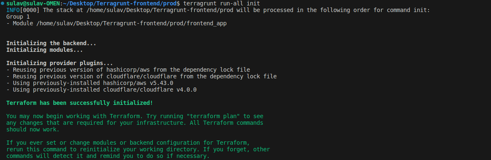

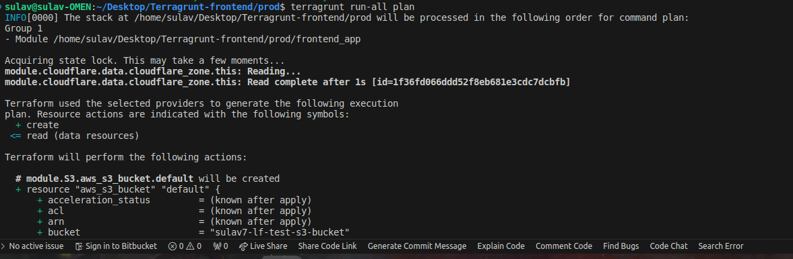

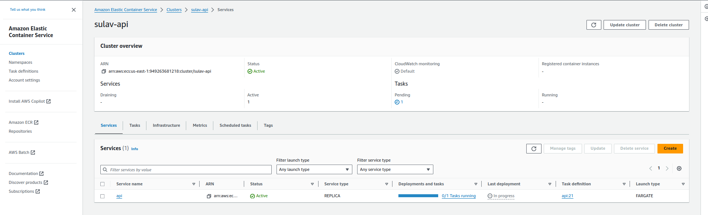

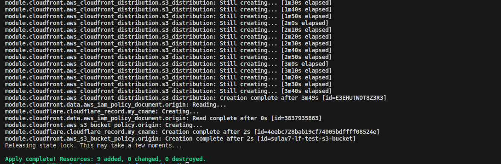

GIF:

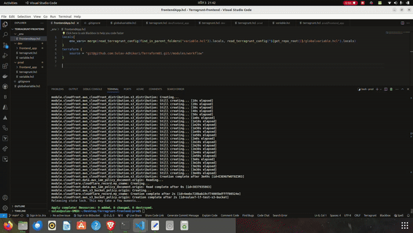


Deleting all resources:

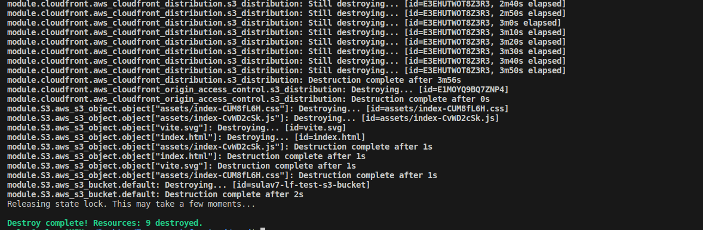


# 2

The Terragrunt hcl code for Qno2 is in the directory `./materisals/Terragrunt_Q2`

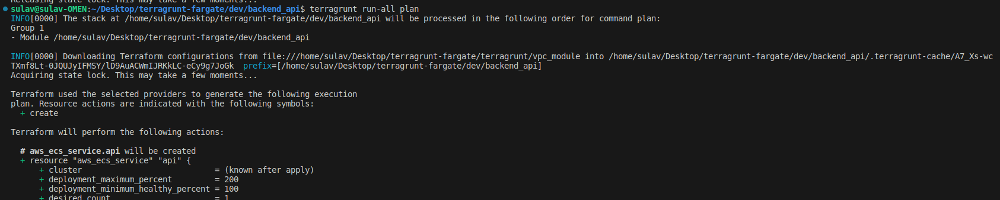

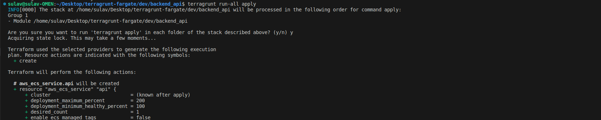


VPC created successfully :

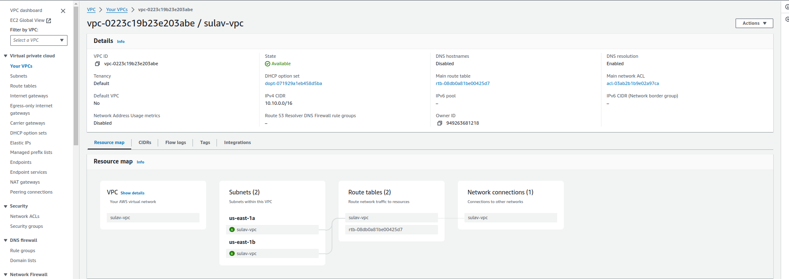

ECS task executed successfully:


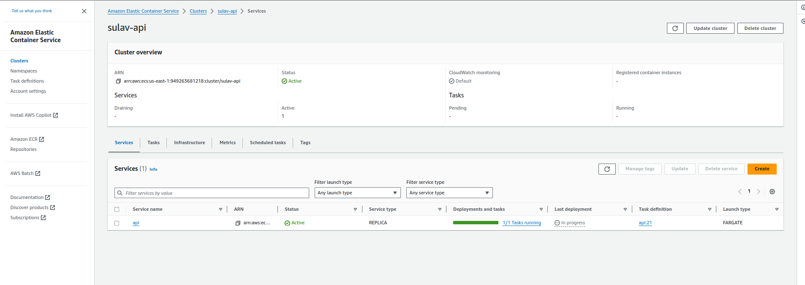


Destroying all resources:

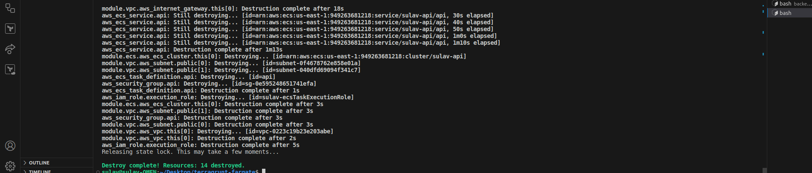


# 3 What is terraform cloud and why would you use it?

Terraform Cloud is a service provided by HashiCorp, the creators of Terraform, an open-source infrastructure as code (IaC) tool. Terraform Cloud offers a managed environment for collaboration and automation with Terraform, facilitating infrastructure provisioning and management across various cloud providers, on-premises environments, and other infrastructure components.

Here are some key features and reasons why you might use Terraform Cloud:

Remote State Management: Terraform Cloud provides a centralized location for storing Terraform state files. This enables teams to collaborate on infrastructure projects more effectively and securely, as it eliminates the need to manage state files locally or share them manually.

Collaboration: Teams can work together on infrastructure projects more efficiently by sharing configurations, collaborating on changes, and managing access controls within Terraform Cloud. It offers features like organization accounts, workspace management, and role-based access control (RBAC).

Automated Workflows: Terraform Cloud supports automated workflows for infrastructure provisioning and deployment. It can integrate with version control systems like Git, allowing you to trigger Terraform runs automatically whenever there are changes to infrastructure configurations.

Policy Enforcement: Terraform Cloud enables organizations to enforce policies and best practices for infrastructure provisioning and management. This includes implementing policies for security, compliance, and cost optimization.

Scalability and Reliability: Terraform Cloud is a managed service provided by HashiCorp, which means it offers scalability and reliability benefits. It can handle large-scale infrastructure deployments and ensures high availability of infrastructure resources.

Remote Operations: Terraform Cloud can execute Terraform operations remotely, which can be beneficial in scenarios where running Terraform locally might not be feasible or practical. This includes situations where infrastructure resources are distributed across multiple cloud providers or regions.

Overall, Terraform Cloud streamlines the process of managing infrastructure as code, enhances collaboration among teams, and provides a scalable and reliable platform for automating infrastructure provisioning and management tasks.


# 4 Write a cloudformation template to create vpc and a security group for API


The template for the creating the vpc is in the directory `./materials/CloudformationTemplate.yml`


Template for creating a VPC and security group for APT:


```yml
AWSTemplateFormatVersion: '2010-09-09'
Description: VPC,SUBNET,Security group
Resources:
  VPC:
    Type: AWS::EC2::VPC
    Properties:
      CidrBlock: "10.192.0.0/16"
      EnableDnsSupport: true
      EnableDnsHostnames: true
      Tags:
        - Key: Name
          Value: sulav
        - Key: Creator
          Value: sulav.adk.7@gmail.com
        - Key: Deleteable
          Value: Yes
        - Key: Project
          Value: Intern

  sulavSubnet1:
    Type: AWS::EC2::Subnet
    Properties:
      VpcId: !Ref VPC
      AvailabilityZone: us-east-1a
      CidrBlock: "10.192.10.0/24"
      MapPublicIpOnLaunch: true
      Tags:
        - Key: Name
          Value: Sulav-Subnet-1
        - Key: Creator
          Value: sulav.adk.7@gmail.com
        - Key: Deleteable
          Value: Yes
        - Key: Project
          Value: Intern

  sulavSecurityGroup:
    Type: AWS::EC2::SecurityGroup
    Properties:
      GroupDescription: Security Group for PublicSubnet1
      VpcId: !Ref VPC
      SecurityGroupIngress:
        - IpProtocol: tcp
          FromPort: 3000
          ToPort: 3000
          CidrIp: 10.192.0.0/16 # Allow HTTP traffic from anywhere
      Tags:
        - Key: Name
          Value: SecurityGroup
        - Key: Creator
          Value: sulav.adk.7@gmail.com
        - Key: Deleteable
          Value: Yes
        - Key: Project
          Value: Intern

Outputs:
  VpcId:
    Value: !Ref VPC
    Description: VPC ID
  PublicSubnet1Id:
    Value: !Ref sulavSubnet1

  PublicSubnet1SecurityGroupId:
    Value: !Ref sulavSecurityGroup
```

Stack Deployed:

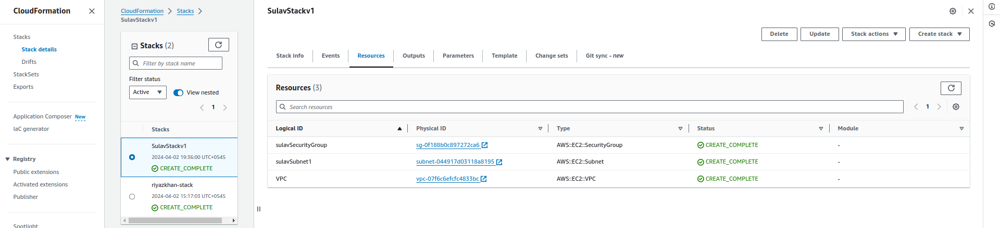

VPC:

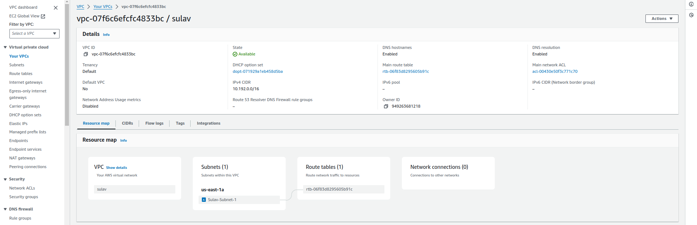

Subnet:

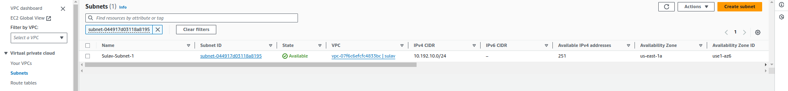

Security group:

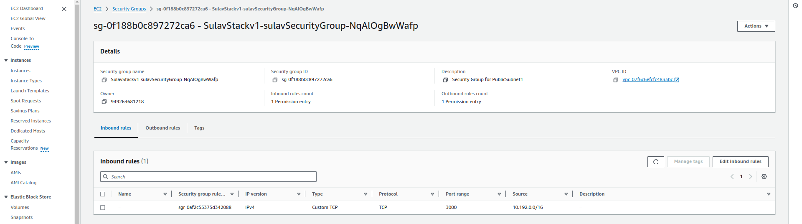